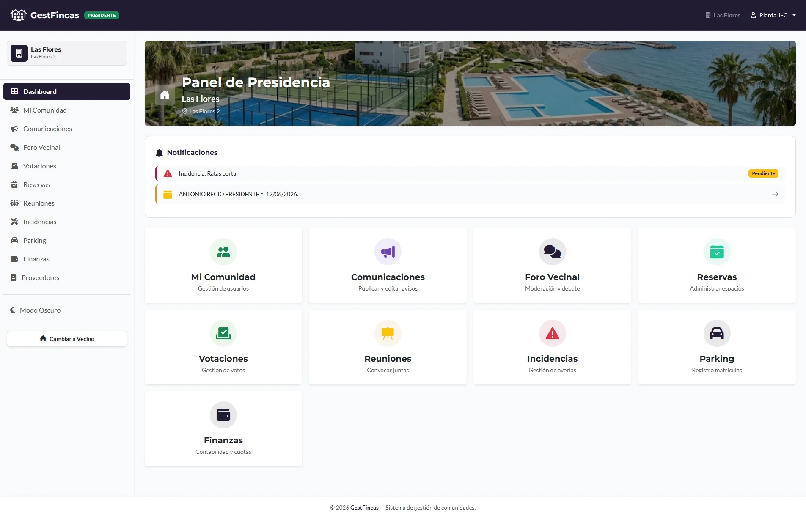
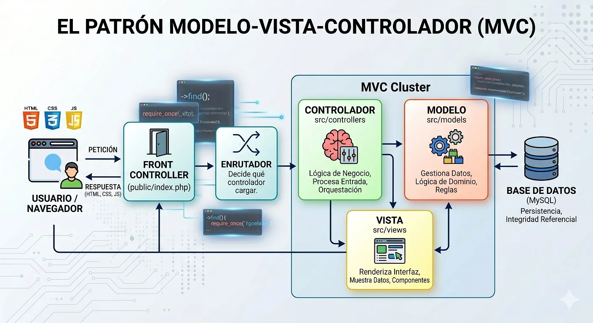

# 🏢 Gestfincas: Web App de Gestión Comunitaria


Este repositorio contiene el código fuente de **Gestfincas**, una solución integral y moderna diseñada para la administración automatizada de fincas y comunidades de vecinos. Desarrollado en colaboración por un equipo de 5 desarrolladores como proyecto de fin de ciclo (DAW), el sistema simula un entorno real de gestión comunitaria, separando flujos de trabajo e interfaces bajo una sólida arquitectura **Modelo-Vista-Controlador (MVC)**.

## 🎯 Contexto y Valor de Negocio

La gestión tradicional de comunidades de vecinos a menudo sufre de procesos manuales, falta de transparencia financiera y comunicaciones fragmentadas (notas en el portal, grupos de mensajería caóticos). 

Este sistema centraliza, digitaliza y gobierna la información operativa de la finca para dar respuesta a **necesidades estratégicas** mediante paneles interactivos orientados a diferentes roles:

* **Transparencia Financiera:** ¿Cuál es el estado de mis cuotas como vecino? ¿Cuál es el balance global y el nivel de morosidad que audita el Presidente?
* **Operaciones y Mantenimiento:** ¿Qué incidencias o averías están activas, quién las reportó y cuál es su estado de resolución?
* **Gobernanza y Convivencia:** ¿Cómo se toman decisiones vinculantes de forma remota y cómo se democratiza el acceso a las actas de reuniones y espacios comunes?

<p align="center">
  
</p>

---

## 🚀 Stack Tecnológico

* 🐘 **Backend & Lógica:** PHP 7.4+ (POO, Enrutamiento Dinámico).
* 🗄️ **Base de Datos:** MySQL (Relacional, Triggers, Integridad Referencial).
* 🎨 **Frontend & UI:** HTML5, CSS3 (Variables nativas), JavaScript (ES6 asíncrono) y Bootstrap 5.3.
* 📦 **Gestión de Paquetes:** Composer.
* ⚙️ **Control de Versiones:** Git / GitHub.

---

## 📐 Arquitectura de Software (MVC)

El proyecto está diseñado bajo una estricta separación de responsabilidades para garantizar seguridad, escalabilidad y un mantenimiento ágil.

<p align="center">
  
</p>

1. 🥇 **Controladores (`src/controllers`):** Actúan como el cerebro de la aplicación. Interceptan la petición del usuario, aplican reglas de negocio, validan permisos (RBAC) y orquestan la comunicación entre Modelos y Vistas.
2. 🥈 **Modelos (`src/models`):** Capa de abstracción de datos. Encapsulan todas las sentencias SQL preparadas para prevenir inyecciones y garantizan la integridad transaccional con la base de datos MySQL.
3. 🥉 **Vistas (`src/views`):** Componentes modulares de interfaz gráfica renderizados al cliente. Utilizan plantillas de componentes (`components/`) como topbars, sidebars y modales reutilizables.

**Punto Único de Entrada (Front Controller):** Toda petición pasa por `public/index.php`. Este diseño blinda el directorio `src/` y `config/` del acceso directo desde el navegador, asegurando que solo los recursos estáticos queden expuestos.

---

## 📂 Estructura del Repositorio

```text
gestfincas/
├── config/              # Archivos de conexión a BD, variables globales y Router
├── database/            # Volcado estructurado de la Base de Datos (gestfincas.sql)
├── public/              # Directorio público y punto de entrada al servidor web
│   ├── assets/          # CSS, JS, e imágenes (UI)
│   ├── uploads/         # Archivos dinámicos seguros (Imágenes de incidencias, Actas PDF)
│   └── index.php        # Front Controller
├── src/                 # Lógica core de negocio (Protegida del acceso web)
│   ├── controllers/     # Controladores por módulo (Finanzas, Reservas, Auth...)
│   ├── models/          # Lógica de base de datos
│   └── views/           # Vistas y fragmentos HTML/PHP reutilizables
├── vendor/              # Librerías gestionadas por Composer (Autocargadas)
├── .gitignore           # Archivos ignorados por Git
├── composer.json        # Declaración de dependencias (PHPMailer, Dompdf)
└── README.md            # Documentación del proyecto
```

---

## ⚙️ Módulos y Características Clave

### 🔐 1. Autenticación y Control de Acceso (RBAC)
* **Roles Jerárquicos:** Flujos y menús adaptados dinámicamente para **Vecino**, **Presidente** y **Superadministrador**.
* **Seguridad de Credenciales:** Encriptación robusta usando el algoritmo nativo `password_hash`.
* **Recuperación de Cuentas:** Sistema de tokens temporales de un solo uso enviados vía SMTP para el restablecimiento de contraseñas.

### 📊 2. Finanzas y Dashboard
* **Presidente:** Panel analítico para cargar presupuestos, registrar cobros/pagos y monitorizar impagos.
* **Vecino:** Historial personal interactivo de recibos emitidos y pendientes de liquidar.

### 📅 3. Reservas de Espacios Comunes
* Sistema de calendario interactivo para apartar instalaciones (ej: pádel, piscina, salas).
* Manejo de franjas horarias y solapamientos en tiempo real gestionado íntegramente con JavaScript y PHP.

### 📢 4. Actas, Votaciones e Incidencias
* **Generación PDF Dinámica:** Creación automatizada de Actas de Reuniones en el servidor utilizando `dompdf`.
* **Kanban de Averías:** Panel interactivo para reportar incidencias estructurales con carga segura de imágenes `.webp` (optimizadas para rendimiento).
* **Foros y Votaciones:** Espacio de debate seguro y sistema de encuestas vinculantes inmutables.

---

## 🧠 Retos Técnicos y Soluciones

Durante el ciclo de desarrollo, se implementaron refactorizaciones críticas para asegurar la calidad y madurez del código:

* **Gestión Profesional de Dependencias:** El proyecto pasó de alojar miles de líneas de librerías externas en formato manual (carpeta *libs*) a utilizar **Composer**. Esto redujo drásticamente el peso del repositorio, estandarizó el uso de un *Autoloader* nativo (PSR-4) y delegó la actualización de paquetes como `PHPMailer` y `dompdf` a un estándar industrial.
* **Seguridad en la Subida de Archivos:** Las imágenes adjuntas a las incidencias generaban riesgos de seguridad (subida de scripts maliciosos). **Solución:** Implementación de validación estricta de tipos MIME en PHP, conversión forzada a formato `.webp`, ofuscación de nombres con identificadores únicos (`uniqid()`) y almacenamiento fuera de rutas ejecutables en el backend.
* **Aislamiento del Core (Front Controller):** Las rutas iniciales apuntaban directamente a archivos físicos `.php`, exponiendo la estructura del servidor. **Solución:** Centralización de las rutas a través de un `router.php`, procesando variables por la URL (ej: `?controller=Incidencias&action=crear`) para mapear dinámicamente los controladores, logrando URLs limpias y seguras.

---

## 🛠️ Configuración y Prerrequisitos

### Prerrequisitos del Sistema
* Servidor local Apache/Nginx (XAMPP, Laragon, etc).
* PHP 7.4 o superior (Con extensión `zip` habilitada).
* MySQL 8.0 o MariaDB.
* [Composer](https://getcomposer.org/) instalado globalmente.

---

## 🏃‍♂️ Ejecución y Despliegue en Local

### Paso 1: Clonar y Preparar Dependencias
Abre una terminal, clona el proyecto y descarga los paquetes gestionados en `composer.json`:

```bash
git clone https://github.com/tu-usuario/gestfincas.git
cd gestfincas
composer install
```
*(Este comando generará automáticamente la carpeta `vendor/` con los recursos necesarios).*

### Paso 2: Base de Datos y Variables
1.  Importa el esquema relacional estructurado que encontrarás en `database/gestfincas.sql` a tu gestor de base de datos MySQL.
2.  Renombra o duplica el archivo `config/config.php.example` a `config/config.php`.
3.  Abre `config.php` y ajusta las credenciales de base de datos y tus parámetros SMTP para el envío de correos:
    ```php
    define('DB_HOST', 'localhost');
    define('DB_USER', 'tu_usuario');
    define('DB_PASS', 'tu_contraseña');
    define('DB_NAME', 'gestfincas');
    ```

### Paso 3: Lanzar la Aplicación
Apunta el *DocumentRoot* de tu servidor local hacia el directorio `public/` del proyecto. Si usas el servidor integrado de PHP para pruebas, ejecuta desde la raíz:

```bash
php -S localhost:8000 -t public/
```
Accede desde el navegador a `http://localhost:8000`.

---

## 👥 Equipo y Coautoría

Este software ha sido diseñado, maquetado y programado colaborativamente por 5 estudiantes del ciclo formativo de Desarrollo de Aplicaciones Web:

* **Raul Beardo** - Desarrollador Full Stack
* **César Betancor** - Desarrollador Full Stack
* **Alejandro Morales** - Desarrollador Full Stack
* **Moisés Moreno** - Desarrollador Full Stack
* **Natalia Pérez Gamero** - Desarrollador Full Stack
* **Lidia Ruiz de Valdivia** - Desarrollador Full Stack

---

## 📩 Contacto

Si tienes alguna pregunta técnica sobre la arquitectura de este proyecto, sugerencias, o estás interesado en conversar sobre ingeniería y desarrollo de software, ¡no dudes en escribirme!

<p align="left">
<a href="https://www.linkedin.com/in/cesarbetancorcano/" target="blank"></a>
</p>

* **LinkedIn:** [César Betancor Cano](https://www.linkedin.com/in/cesarbetancorcano/)
* **Portfolio:** [btncr13.github.io](https://btncr13.github.io/portfolio/)
* **Email:** [betancor13@gmail.com](mailto:betancor13@gmail.com)

---

## 📄 Licencia

Este proyecto se distribuye bajo la Licencia MIT. Siéntete libre de usarlo, modificarlo y distribuirlo para fines educativos o de portfolio profesional.